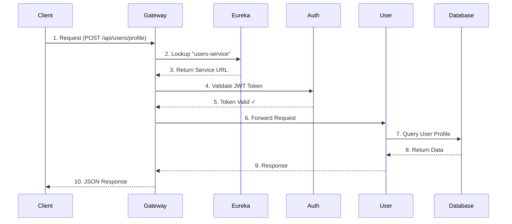
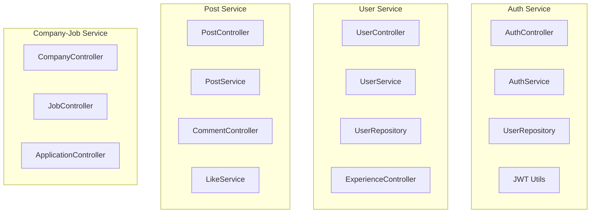
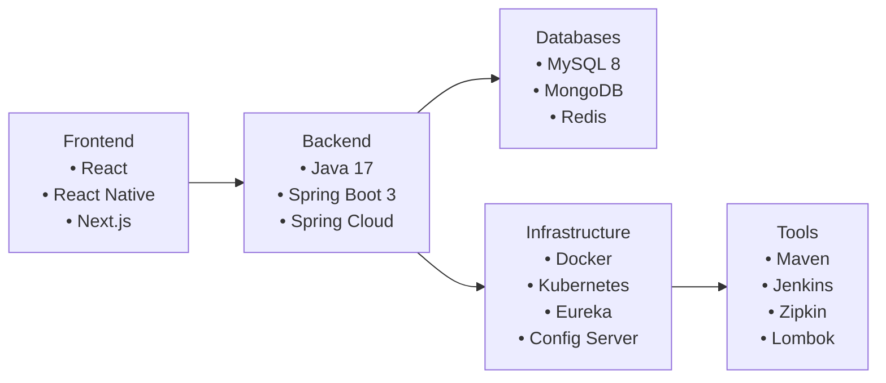
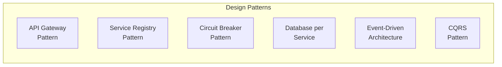

# LinkedIn Clone - Architecture Diagram

## High-Level System Architecture

```mermaid
flowchart TB
    subgraph Client["👥 Client Layer"]
        Mobile["Mobile App"]
        Web["Web App"]
    end

    subgraph Gateway["🚀 API Gateway / Load Balancer"]
        Gateway["Spring Cloud Gateway / Nginx"]
    end

    subgraph Discovery["🔍 Service Discovery"]
        Eureka["Netflix Eureka\nService Registry"]
    end

    subgraph Services["☁️ Microservices"]
        Auth["Auth Service\n🔐\n• Register\n• Login\n• JWT Token"]
        User["User Service\n👤\n• Profiles\n• Experiences\n• Connections"]
        Post["Post Service\n📝\n• Posts\n• Comments\n• Likes"]
        Company["Company-Job Service\n🏢\n• Companies\n• Jobs\n• Applications"]
        Chat["Chat Service\n💬\n• Messages\n• Chats"]
        File["File Service\n📁\n• Upload\n• Download"]
    end

    subgraph Database["🗄️ Databases"]
        AuthDB[(Auth DB\nMySQL)]
        UserDB[(User DB\nMySQL)]
        PostDB[(Post DB\nMySQL)]
        CompanyDB[(Company DB\nMySQL)]
        ChatDB[(Chat DB\nMongoDB)]
        FileDB[(File Storage\nMinIO/S3)]
    end

    subgraph Monitoring["📊 Monitoring & Config"]
        Config["Spring Config\nServer"]
        Zipkin["Zipkin\nDistributed Tracing"]
    end

    %% Client to Gateway
    Mobile --> Gateway
    Web --> Gateway

    %% Gateway to Services
    Gateway --> Auth
    Gateway --> User
    Gateway --> Post
    Gateway --> Company
    Gateway --> Chat
    Gateway --> File

    %% Services to Eureka
    Auth --> Eureka
    User --> Eureka
    Post --> Eureka
    Company --> Eureka
    Chat --> Eureka
    File --> Eureka

    %% Services to Databases
    Auth --> AuthDB
    User --> UserDB
    Post --> PostDB
    Company --> CompanyDB
    Chat --> ChatDB
    File --> FileDB

    %% Services to Config
    Auth --> Config
    User --> Config
    Post --> Config
    Company --> Config
    Chat --> Config
    File --> Config
```

---

## Service Communication Flow



---

## Microservices Breakdown



---

## Technology Stack



---

## Key Design Patterns Used



---

## Interview Talking Points

### 1. **Why Microservices?**
- ✅ Independent deployment
- ✅ Scalability per service
- ✅ Technology flexibility
- ✅ Fault isolation

### 2. **Service Discovery**
- Netflix Eureka for dynamic service registration
- Services register on startup, deregister on shutdown
- Client-side load balancing with Ribbon

### 3. **API Gateway**
- Single entry point for all clients
- Authentication/Authorization
- Request routing, rate limiting

### 4. **Inter-Service Communication**
- REST APIs for synchronous communication
- Can use Kafka/RabbitMQ for async (event-driven)

### 5. **Database Strategy**
- Each service has its own database
- No shared databases = loose coupling
- Polyglot persistence (MySQL, MongoDB)

### 6. **Security**
- JWT tokens for authentication
- Token validation at API Gateway
- Role-based access control (RBAC)

### 7. **Configuration Management**
- Spring Cloud Config Server
- Centralized configuration
- Environment-specific configs
